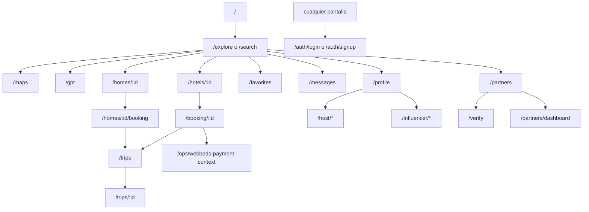

# Mapeo de screens - BookingGPT Web

Fecha de corte: 2026-04-25

## Alcance

Este mapeo esta basado en el frontend web ubicado en `bookingGPTFront/apps/web`, tomando como fuente principal:

- `src/routes/AppRouter.jsx`
- `src/layouts/AppLayout.jsx`
- `src/pages/*`
- `src/components/auth/AuthModal.jsx`
- `src/components/host/HostShell.jsx`
- `src/components/influencer/InfluencerShell.jsx`

## Resumen ejecutivo

- La entrada real del web no es `/`, sino `/explore`.
- `/` redirige a `/explore`, por lo que `Home.jsx` hoy no esta conectado al router.
- Hay 30 paths funcionales en el shell principal, 1 fallback (`*`) y 2 estados modales de auth (`/auth/login`, `/auth/signup`).
- `Search.jsx` sirve dos rutas: `/explore` y `/search`.
- La navegacion se organiza por 6 dominios:
  - discovery y booking
  - cuenta y soporte
  - partners
  - host
  - influencer
  - auth y fallback

## Mapa de navegacion

## Como funciona el shell

`AppLayout.jsx` cambia bastante el chrome segun la ruta:

- `explore landing`: `/explore` o `/search` sin `where` ni `placeId`
- `explore results`: `/explore` o `/search` con busqueda activa
- `maps`: comparte look premium y search bar expandida
- `hotel detail`: mantiene header premium
- `booking`: forza header compacto
- `gpt`: oculta el chrome estandar y usa layout propio
- `partners/dashboard`: tiene tratamiento especial distinto al resto del shell

## Leyenda de acceso

- `Publica`: sin guard en router
- `Soft auth`: sin guard en router, pero consume datos de sesion o cuenta
- `Guard auth`: protegida por wrapper y redirige a login
- `Guard host`: requiere login + `isHostEligible`
- `Guard influencer`: requiere login + `isInfluencerEligible`
- `Admin in-page`: la pagina valida permisos dentro del componente

## Inventario de screens activas

### 1. Discovery y booking

| Ruta | Screen / componente | Acceso | Rol |
| --- | --- | --- | --- |
| `/explore` | `Search.jsx` | Publica | Landing y resultados de hoteles/homes |
| `/search` | `Search.jsx` | Publica | Alias funcional de explore |
| `/maps` | `Maps.jsx` | Publica | Resultados sobre Google Maps |
| `/gpt` | `Assistant.jsx` | Guard auth | Asistente IA con resultados navegables |
| `/hotels/:id` | `HotelDetail.jsx` | Publica | Detalle de hotel, rates, rooms, mapa, favoritos |
| `/booking/:id` | `Booking.jsx` | Publica | Checkout hotel con WebBeds + Stripe |
| `/homes/:id` | `HomeDetail.jsx` | Publica | Detalle de home stay |
| `/homes/:id/booking` | `HomeBooking.jsx` | Publica | Checkout de homes |

Flujo principal de este bloque:

- `Search.jsx` puede mandar a `/maps`, `/gpt`, `/hotels/:id` y `/homes/:id`.
- `Maps.jsx` vuelve a `/explore` y abre `/hotels/:id`.
- `Assistant.jsx` puede llevar a `/explore`, `/maps`, `/messages` y `/hotels/:id`.
- `HotelDetail.jsx` dispara `/booking/:id` y conserva contexto de retorno a search/favorites/gpt.
- `Booking.jsx` termina en `/trips`.
- `HomeDetail.jsx` manda a `/homes/:id/booking`.
- `HomeBooking.jsx` tambien termina en `/trips`.

Dependencias mas visibles:

- `Search.jsx`: `useExploreHotels`, `useExploreHomes`, `ExploreLandingHero`, `ExploreSidebar`, `ExploreSectionList`, favoritos y places autocomplete.
- `Maps.jsx`: `searchHotels`, `fetchPlaceGeocode`, `PREMIUM_EXPLORE_MAP_OPTIONS`.
- `Assistant.jsx`: `useAssistantController`, `AssistantResultExplorer`, `AssistantMessageResults`.
- `HotelDetail.jsx`: `HotelDetailHero`, `HotelRateSheet`, `HotelRoomsSection`, `HotelMapModal`.
- `Booking.jsx`: `CheckoutProgress`, `GuestDetailsForm`, `PaymentSection`, `RateDetailsCard`.

### 2. Cuenta, soporte y post-booking

| Ruta | Screen / componente | Acceso | Rol |
| --- | --- | --- | --- |
| `/messages` | `Messages.jsx` | Soft auth | Inbox de chats y soporte |
| `/profile` | `Profile.jsx` | Soft auth | Datos de usuario, wallet, reviews, modos |
| `/trips` | `Trips.jsx` | Soft auth | Listado de reservas del usuario |
| `/trips/:id` | `TripDetail.jsx` | Soft auth | Detalle de reserva, voucher, cancelacion, soporte |
| `/favorites` | `Favorites.jsx` | Soft auth | Favoritos y vistos recientes |
| `/download` | `DownloadApp.jsx` | Publica | Landing para descarga de app |
| `/privacy` | `PrivacyPolicy.jsx` | Publica | Politica de privacidad |
| `/terms` | `Terms.jsx` | Publica | Terminos y condiciones |

Notas de flujo:

- `Messages.jsx` usa `ChatRoom.jsx` como sub-screen embebida, no como ruta propia.
- `Profile.jsx` es el pivote para entrar a modo host e influencer.
- `Trips.jsx` manda a `/trips/:id`.
- `TripDetail.jsx` permite cancelar booking y abrir soporte.
- `Favorites.jsx` reabre hoteles en `/hotels/:id` con contexto de retorno a favoritos.

### 3. Partners y verificacion hotelera

| Ruta | Screen / componente | Acceso | Rol |
| --- | --- | --- | --- |
| `/partners` | `Partners.jsx` | Publica | Landing comercial + claim flow |
| `/verify` | `PartnerVerify.jsx` | Publica | Claim/verificacion por codigo o hotel id |
| `/partners/dashboard` | `PartnersDashboard.jsx` | Soft auth | Dashboard operativo y comercial del partner |

Flujo principal:

- `Partners.jsx` muestra planes, permite buscar hotel y reclamarlo.
- `Partners.jsx` deriva a `/verify` para acceso por codigo o a `/partners/dashboard`.
- `PartnerVerify.jsx` tambien desemboca en `/partners/dashboard`.
- `PartnersDashboard.jsx` concentra perfil publico, performance, growth tools, subscription y lifecycle.

### 4. Host area protegida

| Ruta | Screen / componente | Acceso | Rol |
| --- | --- | --- | --- |
| `/host` | `HostDashboard.jsx` | Guard host | KPIs y reservas del host |
| `/host/listings` | `HostListings.jsx` | Guard host | Lista y alta de propiedades |
| `/host/listings/:id` | `HostListingDetail.jsx` | Guard host | Edicion detallada de una propiedad |
| `/host/calendar` | `HostCalendar.jsx` | Guard host | Calendario de disponibilidad |
| `/host/calendar/:id` | `HostCalendarDetail.jsx` | Guard host | Ajuste fino por propiedad/dia |
| `/host/earnings` | `HostEarnings.jsx` | Guard host | Ingresos y resumen financiero |
| `/host/payouts` | `HostPayouts.jsx` | Guard host | Cuenta de cobro y payouts |

Notas:

- El shell propio vive en `components/host/HostShell.jsx`.
- Si no hay login, el wrapper redirige a `/auth/login`.
- Si el usuario no es elegible como host, redirige a `/profile`.

### 5. Influencer area protegida

| Ruta | Screen / componente | Acceso | Rol |
| --- | --- | --- | --- |
| `/influencer` | `InfluencerDashboard.jsx` | Guard influencer | Stats, codigo de referral, wallet |
| `/influencer/referrals` | `InfluencerReferrals.jsx` | Guard influencer | Referidos y conversiones |
| `/influencer/payouts` | `InfluencerPayouts.jsx` | Guard influencer | Cuenta de cobro y payouts |

Notas:

- El shell propio vive en `components/influencer/InfluencerShell.jsx`.
- El wrapper activa `enterInfluencerMode()` cuando el usuario es elegible.

### 6. Operaciones, auth y fallback

| Ruta | Screen / componente | Acceso | Rol |
| --- | --- | --- | --- |
| `/ops/webbeds-payment-context` | `MerchantWebbedsContext.jsx` | Admin in-page | Captura y limpieza de merchant context WebBeds |
| `/auth/login` | `AuthModal.jsx` | Publica | Modal de login sobre background route |
| `/auth/signup` | `AuthModal.jsx` | Publica | Modal de signup sobre background route |
| `*` | `NotFound.jsx` | Publica | Fallback de rutas no definidas |

Notas:

- `AuthModal.jsx` no reemplaza el shell: se monta encima de una `backgroundLocation`.
- Si la ruta previa no es segura, el fallback visual del modal pasa a `/explore`.
- `MerchantWebbedsContext.jsx` deja entrar solo a usuarios con `role === 100`; si no, manda a login o profile.

## Hallazgos importantes

### Pantallas presentes pero no enroutadas

| Archivo | Estado actual | Comentario |
| --- | --- | --- |
| `src/pages/Home.jsx` | No enroutada | Parece landing anterior o experimento; `/` hoy redirige a `/explore` |
| `src/pages/Login.jsx` | No enroutada | Reemplazada por `AuthModal.jsx` |
| `src/pages/Signup.jsx` | No enroutada | Reemplazada por `AuthModal.jsx` |
| `src/pages/HotelDetail copy.jsx` | No enroutada | Copia/backup del detalle de hotel |

### Archivo en `pages` que en realidad es sub-screen

| Archivo | Estado actual | Comentario |
| --- | --- | --- |
| `src/pages/ChatRoom.jsx` | Embebida | Solo se usa dentro de `Messages.jsx` |

### Desalineaciones utiles para backlog

- `AppLayout.jsx` todavia conserva logica para `isHomeRoute`, pero el router no monta `Home.jsx`.
- Hay mezcla de rutas realmente protegidas y rutas "soft auth" que dependen del estado interno de cada pagina.
- `PartnersDashboard.jsx` tiene comportamiento casi de mini-producto aparte, con layout especial dentro del shell.
- El flujo de hoteles es mas maduro que el flujo de homes: hoteles tienen search, map, detail, checkout y ops; homes solo detail + booking.

## Recomendacion de orden mental del producto

Si quieres pensar BookingGPT Web por modulos, hoy la estructura real seria:

1. `Discovery`: `/explore`, `/search`, `/maps`, `/gpt`
2. `Conversion`: `/hotels/:id`, `/booking/:id`, `/homes/:id`, `/homes/:id/booking`
3. `Retention`: `/favorites`, `/trips`, `/trips/:id`, `/messages`, `/profile`
4. `Growth B2B`: `/partners`, `/verify`, `/partners/dashboard`
5. `Supply`: `/host/*`
6. `Affiliate`: `/influencer/*`
7. `Ops / soporte`: `/ops/webbeds-payment-context`, legales, auth modal, not found

## Siguiente paso sugerido

Si quieres, el siguiente entregable util seria uno de estos dos:

- un `screen flow` mas visual por modulo, con flechas pantalla a pantalla
- una matriz UX/tecnica con `screen -> componentes -> servicios -> endpoints`
